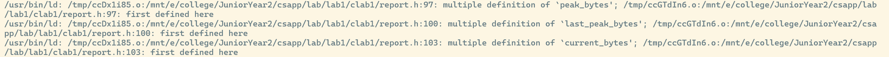
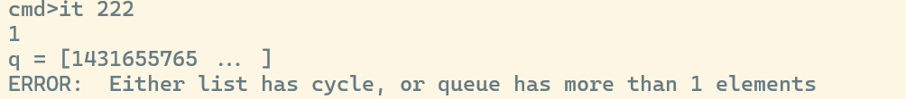

# 实验1

## 1 Debug

### 报错1：变量重定义

- 原因：
- 头文件中定义的全局变量应在.c文件中声明，在.h文件中再次声明的时候必须加上extern！！！



### 报错2：队列有循环？

- 原因：
- 头指针中也需要存储元素！！！



### 报错3：free

不能先释放p，然后才p=p->next，因为此时的p已经是空指针了！！！

```c++
void q_free(queue_t *q)
{
  /* Remember to free the queue structue and list elements */
  if (q == NULL)
    return;
  list_ele_t *p = q->head;
  while (p)
  {
    list_ele_t *t = p;
    p = p->next;
    free(t);
    q->q_size--;
  }
  free(q);
  return;
}
```

## 2 New things

makefile的使用
