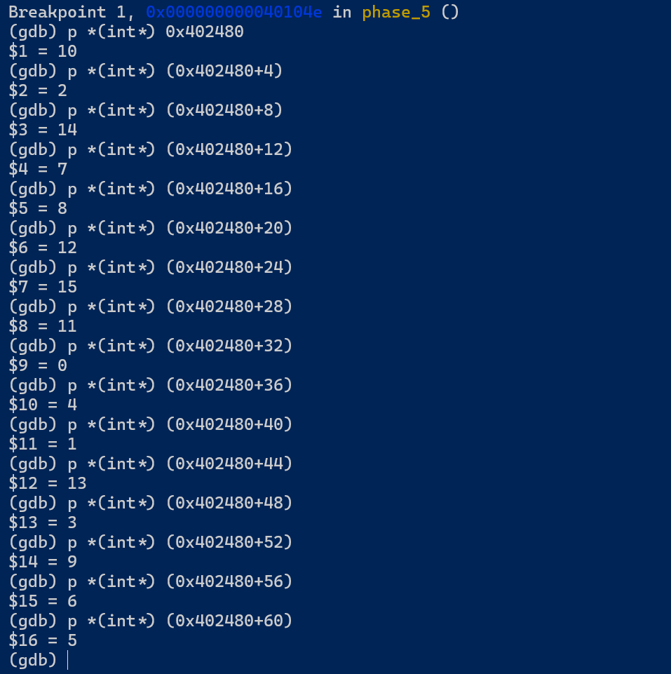

# 实验3 Bomb Lab

## 1 实验内容

本实验要求你使用课程所学知识拆除“binary bombs（二进制炸弹，下文将简称为炸弹）”，增强对程序的机器级表示、汇编语言、调试器和逆向工程等方面原理与技能的掌握。 这里的炸弹是一个Linux可执行程序，包含了6个阶段（或层次、关卡）。炸弹运行的每个阶段要求你输入一个特定字符串，你的输入符合程序预期的输入，该阶段的炸弹就被拆除引信即解除了，否则炸弹“爆炸”打印输出 "BOOM!!!"。实验的目标是拆除尽可能多的炸弹关卡。

## 2 实验环境

- Windows下的WSL

## 3 实验报告

实验过程中发现，所有的phase都大致可以划分为三个部分：

1. 获取输入
2. 处理输入
3. 评判处理的结果

我对每一个阶段的叙述也将从这三点入手。

### phase 1

#### ① Cipher

```tex
Slave, thou hast slain me. Villain, take my purse.
```

#### ② 拆弹过程


1. 0 1 3 6 10 15
2. 0 289
3. 13 3 urxvt
4. 2 35
5. 4 5 6 2 3 1
6. 7


