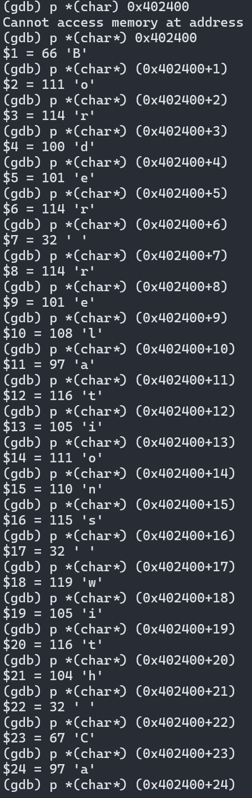
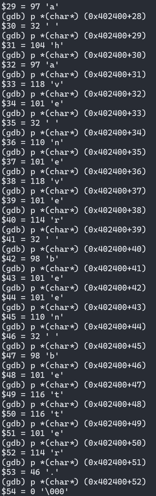
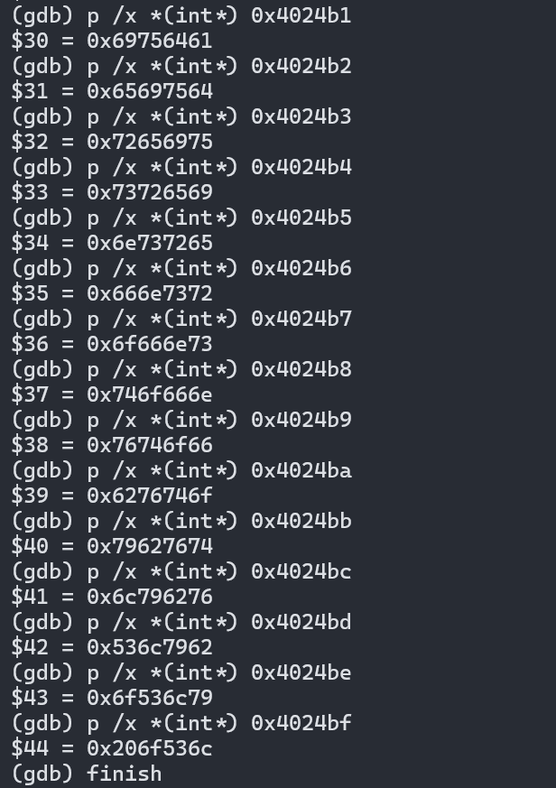

# 传参寄存器

1. rdi
2. rsi
3. rdx
4. rcx
5. r8
6. r9

# 跳转指令


# string_length

```x86
  40131b:	80 3f 00             	cmpb   $0x0,(%rdi)
  40131e:	74 12                	je     401332 <string_length+0x17>
  401320:	48 89 fa             	mov    %rdi,%rdx
  401323:	48 83 c2 01          	add    $0x1,%rdx
  401327:	89 d0                	mov    %edx,%eax
  401329:	29 f8                	sub    %edi,%eax
  40132b:	80 3a 00             	cmpb   $0x0,(%rdx)
  40132e:	75 f3                	jne    401323 <string_length+0x8>
  401330:	f3 c3                	repz ret 
  401332:	b8 00 00 00 00       	mov    $0x0,%eax
  401337:	c3                   	ret
```

1. 传入的字符串为%rdi,如果是空串就返回0
2. 然后每次读一个字符add    $0x1,%rdx
3. 字符串长度的计算用当前字符的地址减去起始字符的地址
4. 返回值就存储在%eax中

# phase1

第一个字符串的长度为52

%rbp中的内容为：0x402400

比较的是两个字符串的内容

从这个地址开始逐一读取内存中的内容：





`Border relations with Canada have never been better.`

# phase2

现在可以确定的是输入的参数个数要大于6

规律为：

第一个数必须是1

后一个数是前一个数的两倍

`1 2 4 8 16 32`

# phase3

```
*0x402470(,%rax,8)
```

地址之前加上一个*表示取这个地址中的内容作为基址进行运算

第一个数作为偏移量，第二个数是利用偏移量计算出来的地址中对应的数

一种可行的组合为：

0 207

# phase4

一种可行的方案为：

`7 0`

首先可以判断出第二个参数一定是0

这是一个递归函数，可以得知最后的返回值必须是0

可以用汇编代码大致写出源代码，然后找出一个符合返回值条件的递归出口即可

# phase5 

要比较的字符串长度为6，且是flyers

但是直接输入的话会boom！

估计是对输入的字符串进行了一些转变

发现截取了输入字符的最低四位

```
and    $0xf,%edx
```

然后将最低四位加上一个基址0x4024b0

由于最低四位的范围是0~f

所以一次查看了这些地址中的值：



用flyers的ascii值去一一对应这些值的最低四位，以此来确定最低四位的值：分别是

```
9 f e 5 6 7
```

也就是加到那一个基址上的偏置值

之后在ascii表中查看低四位是这些的ascii字符

# phase6

推断出6个数都不能相同！

并且6 个数不能高于6

所以只可能是1 2 3 4 5 6，只需要确定他们的排列顺序即可！


发现对mod7运算做了取逆元处理


1:	332->0x6032d0

2:	168->0x6032e0->0x6032d8

3:	924->0x6032f0->0x6032e8

4:	691->0x603300->0x6032f8

5:	477->0x603310->0x603308

6:	443->0x603320-> 0x603318
