# 第二章 信息的表示和处理

## 2.1 信息存储

### 2.1.0 基本概念

#### 1 按字节寻址的本意

- 机器级程序将内存视为一个非常大的字节数组，称为虚拟内存
- 内存的每一个字节都由唯一的一个数字来标识，称为它的地址，所有可能的地址的集合就称为虚拟地址空间

### 2.1.1 十六进制表示法

#### 1 语法要求

1. 十六进制数中的字母A~F既可以是大写，也可以是小写，甚至可以是大小写混写

#### 2 一些技巧

1. 十进制转为二进制的时候，可以先转为16进制，再转换为2进制，这样可以减少除法次数
2. 当x是2的非负整数n次幂的时候，也就是$x=2^n$，把n表示为$i+4j$，然后高位是$2^i$，后面再跟上j个0

### 2.1.2 字数据大小

#### 1 概述

- 每一台机器都有一个字长，虚拟地址是以这样的一个字来编码的
  - 对于一个w字长的机器，虚拟地址范围是$0到2^w-1$

#### 2 C语言的基本数据类型

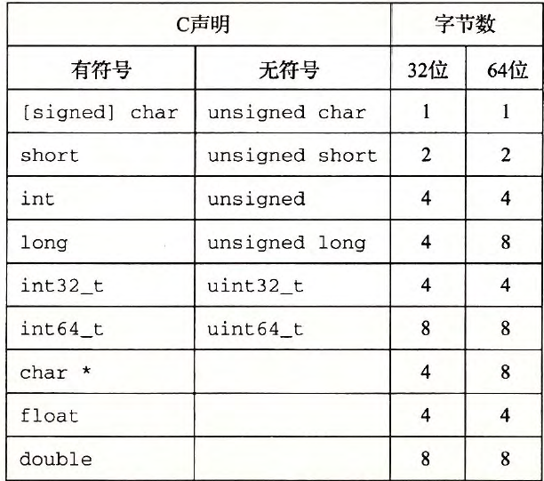

1. 需要注意的是long型，32位机器上是4个字节，64位机器上是8个字节
2. 第二个需要注意的char*类型，这说明<u>**所有的**</u>指针的大小和机器字长是一样的

### 2.1.3 寻址和字节顺序

#### 1 概述

1. 多字节对象被存储在连续的字节序列，对象的地址为所使用的字节中最小的地址

#### 2 字节顺序

##### ① 大端法

- 字节的存放顺序与人阅读的顺序是一样的
- 高位字节存放在低地址处
- 一个对象的地址其实是其最高字节的地址

##### ② 小端法

- 字节的存放顺序与人阅读的顺序是相反的
- 低位字节存放在低地址处，字节的高低与地址的高低是对应的
- 一个对象的地址是其最低字节的地址

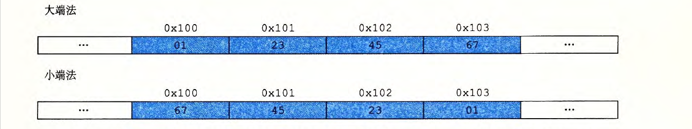

#### 3 例子

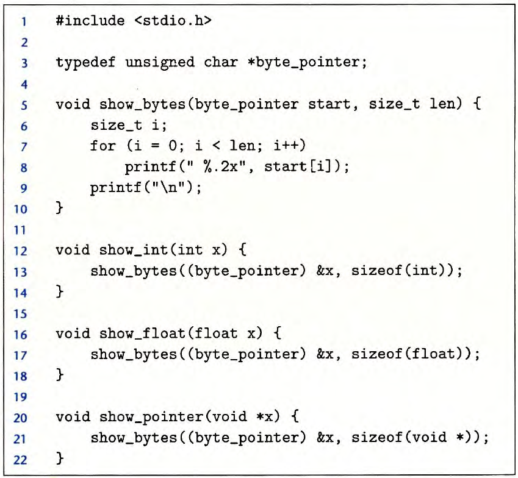

- show_bytes函数会将传入的指针强制转换为unsigned char类型的指针
- 这种转换会告诉编译器，程序应该把这个指针看成是指向一个字节序列，而不是指向一个原始数据类型的对象
- 然后，这个指针会被看成是对象使用的最低字节地址

### 2.1.4 表示字符串

#### 1 概述

1. ACSII中，数字刚好是0x3x，$x\in[0,9]$。

#### 2 要点

1. 字符串的存放顺序与字节顺序和字大小规则无关！！！
2. 也就是说，从左往右，字符的地址依次增加

### 2.1.5 布尔代数

#### 1 一些应用

##### ① 

- “&”和“|”两个运算符之间互相满足分配律

##### ② 位向量

- 可以用来表示有限集合

### 2.1.6 C语言中的位级运算

#### 1 异或操作

- 使用异或可以实现两个数value的交换

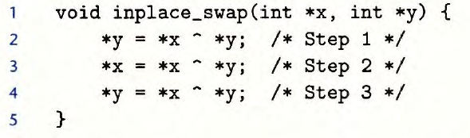

#### 2 掩码操作

##### ① 概述

- 掩码是一个位模式，表示从一个字中选出的位的集合

##### ② 功能

1. 取bit位
2. 设置比特位
3. 比特位清零

### 2.1.7 C语言中的逻辑运算

#### 1 运算符

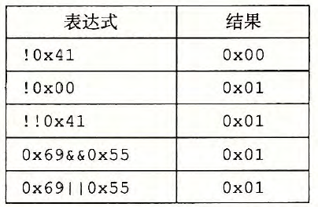

#### 2 要点

- 如果运算式中的第一个参数值就可以确定表达式的结果，逻辑表达式就不会对第二个参数进行求值
- `p&&*p` 避免了引用空指针
- `A&&5/A`避免了除0

### 2.1.8 C语言中的移位运算

#### 1 算术移位vs逻辑移位

右移的时候

- 无符号数，逻辑移位
- 有符号数，算术移位
  - 可以用来获得全为1的数

#### 2 细节问题

##### ① 移位的数值

- 移位的数值按照常理应该为$0\leq k\leq w-1$
- 假如不在这个范围之内的话就对w取模

##### ② 优先级问题

- 加法的优先级比移位运算的要高
- `1<<2+3<<4`会先算加法再进行移位

## 2.2 整数表示

### 2.2.0 概述

####  1 重要公式

$$
\sum\limits_{i=0}^{w-1}2^i=2^w-1
$$

### 2.1.1 无符号数的编码

$$
B2U(X)=\sum\limits_{i=0}^{w-1}x_i2^i
$$

### 2.1.2 补码编码

#### 1 编码规则

$$
B2T(X)=-x_{w-1}2^{w-1}+\sum\limits_{i=0}^{w-2}x_i2^i
$$

#### 2 数值范围

负数的大小就看符号位之后的1的数量，1的个数越多，抵消的负值就越多

1. 最大负数，所有位都是1
2. 最小负数，除了符号位，所有位都是0

最小的负数没有与之对应的正数，如果对其进行求反加1的操作还是会得到原数

#### 3 一些性质

1. 求相反数
   - 除了最小的负数之外，其余所有的补码求相反数的时候都是求反+1
2. 求绝对值
   - 正数不发生改变
   - 负数求相反数即可

### 2.2.3 有符号数和无符号数之间的转换

#### 1 核心思想

- 比特位并没有发生改变，只是解释方式发生了改变，下面的这些计算式只是在求转换之后的解释的数值
- 0~$T_{max}$​之间的部分都没有发生改变，只是这个区间之外的大正数和负数发生了转变
- 这个和求相反数的操作是不一样的！！！

#### 2 T2U

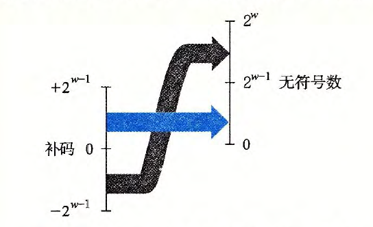
$$
T2U(X_w)=
\left\{
\begin{aligned}
&x+2^w,\quad &x<0\\
&x,\quad &x\geq0
\end{aligned}
\right.
$$
负数之所以加上$2^w$是因为最高位的权值变了！
$$
-x_w2^{w-1}\rightarrow x_w2^{w-1}\\
要完成这个变化要+2\times x_w2^{w-1}=x_w2^w
$$
由于最高位是1，所以也就是加上$2^w$

#### 3 U2T

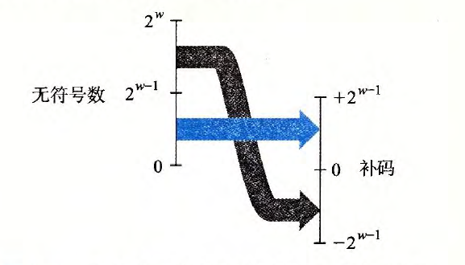
$$
UT2(U_w)=
\left\{
\begin{aligned}
&u,\quad &u\leq T_{max}\\
&u-2^w,\quad &u>t_{max}
\end{aligned}
\right.
$$

### 2.2.4 C语言中的有符号数和无符号数

####  1 概述

1. 创建一个无符号常量的时候，要在末尾加上U或者u

#### 2 强制类型转换

1. 显示转换
2. 隐式转换，如果运算式中有无符号数，则所有的数都转换为无符号数

### 2.2.5 位拓展与位截断

#### 1 位拓展

##### ① 无符号数

- 将一个无符号数拓展为位宽更大的无符号数，只需要补充0

##### ② 有符号数

- 执行符号拓展

##### ③ 混杂出现

- 如果既涉及到位拓展又涉及到U和T之间的转换，那么先执行位拓展，然后再执行类型转换

#### 2 位截断

##### ① 无符号数

- 将x截断为k位$x'$

- $$
  x=B2U(x),\quad x'=B2U(X')\quad,\quad x'=x\mod{2^k}
  $$

  

##### ② 有符号数

- 将x截断为k位$x'$，$x'=U2T(x\mod{2^k})$​

- $$
  x=B2U(x),\quad x'=B2T(X')\quad,\quad x'=U2T(x\mod{2^k})
  $$

  

##### ③ 有意思的地方

1. 这里发现一个好玩的事实，对于二进制数x，对其取$\mod{2^k}$相当于只留下剩下的k-1位
2. 对于负数取mod，相当于加上mod之后的那个数

### 2.2.6 关于有符号数和无符号数的建议

#### 1 无符号数不做减法

```c
实例1：
strlen(s)-strlen(t)>0;应该写为
strlen(s)>strlen(t);

实例2：
length是一个无符号数
for(int i =0;i<length-1;i++)
length为0的时候会报错
应该修改为：
i<length
```

#### 2 变量类型不统一

- 这样会导致隐式的类型转换，比如将有符号负数变为一个很大的无符号正数

## 2.3 整数运算

### 2.3.0 概述

- 记住，运算过程，不论是有符号数还是无符号数，位级表示都是一样的，只不过是运算完之后的解释发生了变化
- 以下的所有的公式都是从十进制数的层面来看待这种解释的变化

### 2.3.1 无符号加法

#### 1 概述

$$
x+^u_wy=
\left\{
\begin{aligned}
&x+y,&x+y<2^w\\
&x+y-2^w,&x+y\geq2^w
\end{aligned}
\right.
$$

#### 2 分析

- 加法会溢出，这就相当于上面所讲的截断操作，相当于$\mod{2^w}$​

- 所以说，无符号加法就是一个取模运算
  $$
  x+^u_wy=(x+y)\mod{2^w}
  $$
  

#### 3 溢出判断

- $s=x+y$，溢出==当且仅当==$s<x(s<y)$

#### 4 无符号数求反

- 虽说是求反，但是无符号数不存在负数，所以求的是它的逆元

$$
-x^u_w=
\left\{
\begin{aligned}
&x,&x=0\\
&2^w-x,&x>0
\end{aligned}
\right.
$$

### 2.3.2 补码加法

#### 1 概述

$$
x+^t_wy=
\left\{
\begin{aligned}
&x+y-2^w,&2^{w-1}\leq x+y\\
&x+y,&-2^{w-1}\leq x+y<2^{w-1}\\
&x+y+2^w,&x+y<-2^{w-1}
\end{aligned}
\right.
$$

#### 2 分析

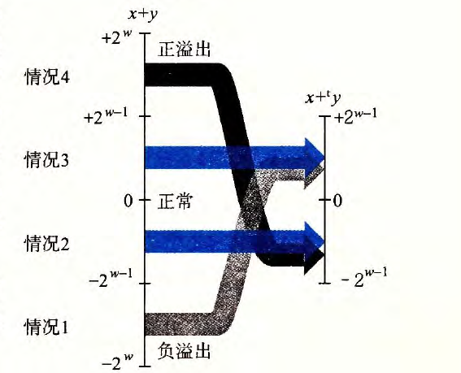

- 上述计算式所求的也是数值
- 推导过程如下图所示：

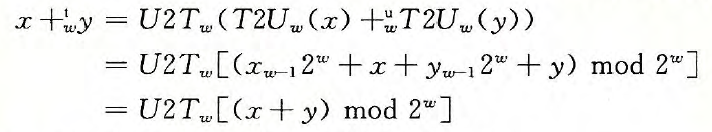

- 先将补码运算转换为无符号运算，之后再转换回来

#### 3 溢出判断

##### ① 正溢出

- $s=x+y$，发生正溢出当且仅当$x>0,\quad y>0$但是$s\leq 0$

##### ② 负溢出

- 与正溢出刚好相反

#### 4 补码的非

$$
-x=
\left\{
\begin{aligned}
&TMin,&x=TMin\\
&-x,&x>TMin
\end{aligned}
\right.
$$

### 2.3.3 无符号乘法

$$
x*^u_wy=(x\cdot y)\mod{2^w}
$$

### 2.3.4 补码乘法

####  1 公式

$$
x*^t_wy=U2T_w((x\cdot y)\mod{2^w})
$$

- 括号里面其实应该有一步是将有符号数先转换为无符号数，只不过可以化简出来这样的形式
- 主要思想和加法是一样的，先将补码转换为无符号数，之后再转换回来

#### 2 无符号和补码乘法的位级等价性

###### Ⅰ 概述

$$
T2B_w(x*^t_wy)=	U2B(x'*^u_wy')
$$

###### Ⅱ 证明

首先
$$
x'=x+x_{w-1}2^w,\quad y'=y+y_{w-1}2^w\\
(x'\cdot y')\mod{2^w}=(x\cdot y)\mod{2^w}
$$
根据等式（15）
$$
T2U_w(x*^t_wy)=T2U_w(U2T_w((x\cdot y)\mod{2^w}))=(x\cdot y)\mod{2^w}=(x'\cdot y')\mod{2^w}
$$
最后，根据（18）和（14）
$$
U2B_w(T2U_w(x*^t_wy))=T2B(x*^t_wy)=U2B_W(x'*^u_wy')
$$

###### Ⅲ 实例

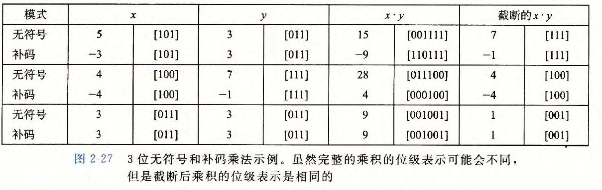

### 2.3.5 乘以常数

#### 1 概述

- 左移K位相当于乘以$2^K$

#### 2 计算方法

现在有x*K，那就先把K用二进制表示出来，然后将K中的0，1串从左向右从0开始编号，记这些编号位为i
$$
原式=\sum_{x_i\neq 0} x<<i
$$

### 2.3.6 除以2的幂

#### 1 向下取整

- 直接左移
  - 对于无符号数来说是逻辑右移
  - 对于补码来说是算术右移

#### 2 向零取整

假设左移k位（相当于除以 $2^k$）

- 正数依然直接右移
- 负数：先加上$2^k-1$再右移

原理：
$$
\lceil x/y\rceil=\lfloor(x+y-1)/y\rfloor
$$
和上面是一样的，对于无符号数是逻辑右移，补码是算术右移

## 2.4 浮点数

### 2.4.1 概述

- 二进制小数只能表示那些能够被写为$x\times 2^y$的数

### 2.4.2 IEEE浮点表示

#### 1 概述

$V=(-1)^s\times M\times 2^E$

- s=0是正数，s=1是负数
- $M\in[1,2-\epsilon)$，或者是0~1-$\epsilon$
- E是阶码，其值等于exp-bias
  - bias=$2^{w-1}-1$

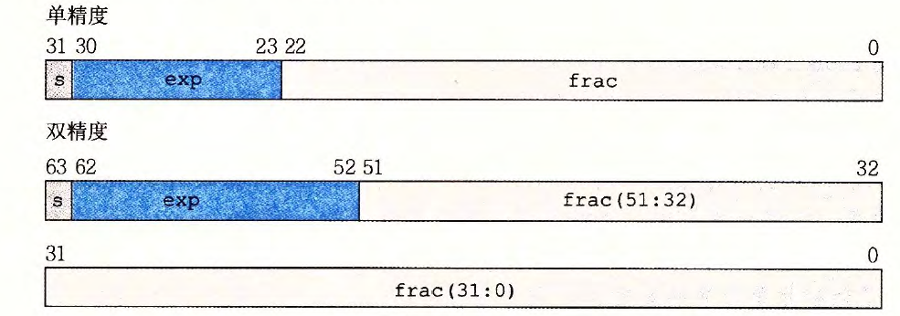

####  2 规格化数

- 隐藏了一个小数点之前的1
- 所以M应该是$1.frac$的形式
- 阶码部分不会出现全为0的情况，exp最小的值为1
- 规格化数在数轴上不是平均分布的！

#### 3 非规格化数

##### ① 概述

- 小数点之前没有隐藏的1
- M部分型如$0.frac$
- 阶码部分全为0，但是E=1-bias，这是为了实现规格化数到非规格化数的平稳过渡
- 非规格化数在数轴上是平均分布的

##### ② 作用

1. 提供了一种表示数值0的方法
2. 表示那些非常接近于0的数

#### 4 特殊值

无穷大和NaN

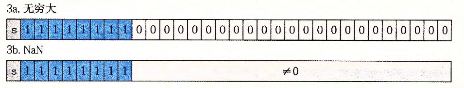

#### 5 值的分布

- 越靠近0越稠密，越远离0越稀疏
- 这说明了浮点数的数值越大，误差越大，因为能精确表示的两个值之间的空隙很大

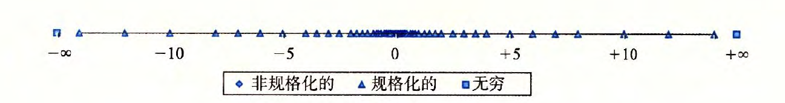


### 2.4.3 舍入

对于一个二进制小数$1.BBGRXXX$

- G要保留的结果的最低位
- R要删除部分的第一位

如果RXXX型如1000···，那么就采用向偶数舍入的方法，因为此时这个数恰好位于两个数之间
